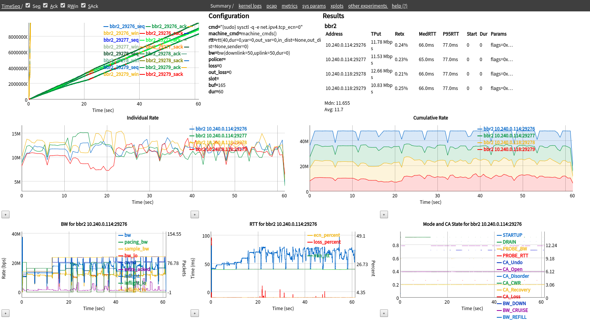

# Transperf
[](https://github.com/google/transperf/blob/master/LICENSE)
[](https://github.com/google/transperf/releases)

Transperf is a tool for testing transport protocol performance. Its key features
include:
* Testing TCP performance over a variety of emulated network scenarios (using
  [netem](https://wiki.linuxfoundation.org/networking/netem)), including RTT,
  bottleneck bandwidth, and policed rate that can change over time.
* Testing multiple flows, on multiple machines.
* Testing multiple congestion control algorithms in a single test.
* Using a Python-based language for specifying test configurations and making
  assertions about the expected results.
* Visualizing results using a web GUI, along with archiving the configuration,
  logs, pcap traces, tcptrace xplot files, and outputs of a test.

[](docs/transperf-screenshot.png)

**Note that this is not an officially supported Google product**.


## CHANGELOG
Please see the [CHANGELOG](CHANGELOG.md) for a release history.


## Documentation quick links
* [Installation](#installation)
* [User Guide](#user-guide)
* [Testing Metrics](#testing-metrics)
* [Examples](#examples)
* [Frequently Asked Questions](#faqs)


## Installation
Because transperf is launched from your local machine and run on a remote host,
there are steps that need to be taken on both your local machine and the remote
host.

### Setup Remote Hosts
The following instructions are specifically for running transperf using [GCE
VMs][GCE] using Debian 9, and may need to be adjusted depending on your testing
environment. The number of instances you need to create depends on the types of
tests you want to run. At minimum, you need two: one receiver and one sender
instance.

1. For each instance, first ensure that each remote host is up-to-date and has
   these dependencies installed.

   On the remote hosts:

   ```
   $ sudo apt update && sudo apt upgrade
   $ sudo apt install rsync psmisc ifenslave pkg-config bison flex git make \
		      bridge-utils util-linux tcpdump
   ```

   Some distributions have an out-of-date version of iproute2, so you should
   install the latest version from source.

   ```
   $ git clone git://git.kernel.org/pub/scm/network/iproute2/iproute2.git
   $ cd iproute2/
   $ ./configure
   $ sudo make install
   ```

2. Then, if you want to test bbrv2, follow the instructions on the [bbr
   repository](https://github.com/google/bbr/tree/v2alpha#obtaining-kernel-sources-with-tcp-bbr-v2-alpha)
   to install a kernel with bbrv2 on each of the remote hosts.

3. Configure rsyslog on remote hosts. By default, rsyslog on Google Cloud
   collects logs too aggressively, which causes issues in collecting kernel log
   output needed by transperf. On each remote machine, edit the following file

   ```
   $ sudo vim /etc/rsyslog.d/90-google.conf
   ```

   by commenting out the final line, as shown below.

   ```cfg
   # Google Compute Engine default console logging.
   #
   # daemon: logging from Google provided daemons.
   # kern: logging information in case of an unexpected crash during boot.
   #
   # daemon,kern.* /dev/console
   ```

   Then, restart rsyslog:

   ```
   $ sudo service rsyslog restart
   ```

4. Enable root login. Transperf needs to execute as root on all remote
   machines, so root login must be enabled by editing the following file

   ```
   $ sudo vim /etc/ssh/sshd_config
   ```

   by finding the line containing `PermitRootLogin` and setting it to `yes`:

   ```cfg
   ...
   # Authentication:

   #LoginGraceTime 2m
   PermitRootLogin yes
   #StrictModes yes
   #MaxAuthTries 6
   #MaxSessions 10
   ...
   ```

   Then, restart sshd:

   ```
   $ sudo service sshd restart
   ```

   Verify that this worked by ensuring you can ssh into the remote machine as
   root:

   ```
   $ ssh root@$HOST
   ```

   Note that you may need to [use gcloud to establish SSH keys
   once](https://cloud.google.com/compute/docs/instances/connecting-advanced#root).
   However, after they keys are exchanged, you should be able to ssh directly.

5. Setup a bonding device on the receiver. Whichever remote host you want to use
   as your receiver must be set up with a bonding device named `eth0`, and the
   physical NIC named `eth1`. To do this, rename the physical device from the
   default value (e.g. `eth0` or `ens4`) to `eth1` by adding the following line
   to the specified file.

   /etc/udev/rules.d/70-persistent-net.rules:
   ```
   SUBSYSTEM=="net", ACTION=="add", ATTR{address}=="<nic hwaddr>", NAME="eth1"
   ```

   Then, create a bonding device named `eth0`, and have `eth1` set as a slave.

   /etc/network/interfaces:
   ```
   # interfaces(5) file used by ifup(8) and ifdown(8)

   auto eth0

   iface eth0 inet dhcp
           bond-mode active-backup
           slaves eth1
   ```

   You will then need to reboot the VM for these changes to take effect. You
   can verify that it worked correctly by running

   ```
   $ ip address
   ```

   and checking that eth0 is a master device, and eth1 is a slave.

   On the senders, you will need to make sure the physical NIC is named `eth0`.
   If it is already named `eth0` (e.g., on Debian) you do not need to do
   anything. Senders do not need a bonding device.

   /etc/udev/rules.d/70-persistent-net.rules:
   ```
   SUBSYSTEM=="net", ACTION=="add", ATTR{address}=="<nic hw addr>", NAME="eth0"
   ```

6. (If using GCE) Ensure that your firewall rules will not block tcp/udp
   traffic. Transperf uses ports 6200 and 6300 explicitly, and also uses
   randomly generated ports to transfer data between senders and receivers.
   Consequently, you need to make sure your [firewall rules in
   GCP](https://cloud.google.com/vpc/docs/firewalls) are set to allow tcp/udp
   traffic between your VMs. That is, if you run

   ```
   gcloud compute firewall-rules list
   ```

   you should see a line like

   ```
   NAME                              NETWORK  DIRECTION  PRIORITY  ALLOW            DENY  DISABLED
   ...
   default-xg4al7wofiqhpghuvl4aw6so  default  INGRESS    1000      tcp,udp                False
   ...
   ```

   if you have configured your firewall rules correctly.

### Setup local machine

Your local machine must be the same architecture as your remote hosts (e.g.,
`x86_64`) because you will be compiling up-to-date binaries on your local
machine, which will then be copied and run on the remote hosts. Your local
machine is also responsible for processing all of the data retrieved from
running the transperf experiment.

1. Install dependencies.

   ```
   $ sudo apt update
   $ sudo apt install python-scapy wireshark tcptrace autoconf texinfo \
                      git build-essential rsync
   ```

2. Build netperf from source to include burst and interval features.

   ```
   $ git clone -b netperf-2.7.0 https://github.com/HewlettPackard/netperf
   $ cd netperf
   $ ./autogen.sh
   $ ./configure --enable-burst --enable-intervals
   $ sudo make install
   ```


## User Guide
### Build
Unlike a [typical Python
package](https://packaging.python.org/tutorials/packaging-projects/), transperf
is run [directly as a ZIP file](https://bugs.python.org/issue1739468). To
prepare the ZIP from the root of the repository, just run:

```
$ make
```

### Quick Start: Multi-server Mode
Most transperf experiments are run in multi-server mode. To run all the test
configurations in the `sample_config` directory on `host1`, `host2`, and `host3`
by launching from your local machine, simply run:

```
$ python transperf.zip -v -x -c sample_config root@host1 root@host2 root@host3
```

If you're using [GCE VMs][GCE], you will need to provide both their external IPs
and internal IPs, like this:

```
$ python transperf.zip -v -x -c sample_config root@ext_ip1/int_ip1 root@ext_ip2/int_ip2 root@ext_ip3/int_ip3
```

Note that the first host provided as a command line argument is used as the
receiver.

### Quick Start: Single-server Mode
Transperf also has basic support for running tests using a single remote
machine, rather than the normal workflow of requiring >= 2 remote machines. This
is accomplished using Linux network containers (via
[netns](https://lwn.net/Articles/580893/)). Note that TCP parameters are not
virtualized. Consequently, tests in single-server mode are limited to using only
a single set of parameters per congestion control algorithm.

To run a test configuration on the remote `host1`:

```
python transperf.zip -v -x -c sample_config/4bbr_50M_40ms_BDP.py --virtcleanup --ssrv host1 root@rcv root@snd1 root@snd2
```

## Testing Metrics
Transperf includes the ability to set expectations for a variety of metrics and
check the results of an experimental run against those expectations. This allows
transperf to be used for high-level testing of transport protocol behavior.

These checks can be customized by including a dictionary of values, as shown
below.

```py
scores = {
    "tput": 90,  # use X% of total bw as goodput
    "rtt_med": 25,  # 100 * minRTT/rtt_i
    "lock_on_bw": 10,  # should exit STARTUP at bw at least x% of bottleneck
    "loss_avoid": 95,  # non-loss percentage
    "fairness": 75,  # jain fairness index * 100 over lifetime
    "convergence_fairness": 85,  # jain fairness for each second after conv
    "convergence_sec": 1.1,  # how long before asserting convergence
}
check = check_with_scores(scores)
```

Each of these values corresponds to one of the following metrics.

#### Goodput (`tput`)
Throughput represents the bits transmitted per second measured during the test
for all the connections, while goodput represents transmission excluding
retransmission and header overhead. The `tput` metric reports the total goodput.
We normalize `tput` into range [0,100] by dividing the total goodput, `b`, by
the bottleneck bandwidth, `BW`, and multiplying by 100.

```
tput = 100 * b / BW
```

#### RTT Reduction (`rtt_med`)
Round-trip time (RTT) represents the two-way latency measured by the congestion
control module. To assign a score that is higher with lower RTT, we use the term
*RTT reduction*. We normalize the RTT reduction as follows:

```
rtt_med = 100 * minRTT_i / medRTT_i
```

where minRTT and medRTT are the minimum and median measured RTTs for a flow,
`i`.

#### Lock on Bandwidth (`lock_on_bw`)
This metric represents the ratio of the bandwidth at which BBR exists STARTUP.
That is, it checks that

```
measured_lock_on_bw_i >= lock_on_target
```

where

```
lock_on_target = (lock_on_bw / 100) * btl_bw / num_conns
```

and subscript `i` represents that this condition is checked for each flow `i`.

#### Loss Avoidance (`loss_avoid`)
Given a loss rate, `l`, ranging from 0 to 1, the normalized loss avoidance score
is the non-loss percent:

```
loss_avoid = 100 * (1 - l)
```

This gives lower loss rate a higher score.

#### Fairness (`fairness`)
We use [Jain's fairness index](https://en.wikipedia.org/wiki/Fairness_measure)
to represent how fair the goodput is allocated between connections during the
test. We adjust the Jain's fairness index from (0,1] to (0,100] as follows.

```
f(b_1, b_2, ..., b_n) = 100 * (sum(b_i))^2 / (n * sum(b_i^2))
```

where `n` is the number of connections and `b_i` is the goodput for connection
`i`.

#### Convergence Fairness (`convergence_fairness`)
Unlike Fairness, which is the pass/fail threshold for the Jain fairness index
for each flow over its entire lifetime, convergence fairness is the minimum
Jain's fairness index that the flow throughputs must have in *every* one-second
time buck after `t = convergence_sec`.


## Examples
Example configurations for transperf tests can be found in
[`sample_config`](sample_config).

[GCE]: https://cloud.google.com/compute/


## FAQs
**I keep getting Permission denied (publickey) even though PermitRootLogin is
yes**

Try running ssh with verbose output (`ssh -v`). If you haven't connected to root
using gcloud, do that once so that SSH keys can be created and transferred.

You may need to specify the identity file created by gcloud (e.g.
`~/.ssh/google_compute_engine`) on your local machine. We recommend just adding
that key using `ssh-agent`:

```
$ eval `ssh-agent`
$ ssh-add ~/.ssh/google_compute_engine
```
